# Generative Agent Simulation Knowledge Graph

This knowledge graph maps the relationship between the codebase components and the concepts described in the research paper "Generative Agent Simulations of 1,000 People" (arXiv:2411.10109).

```mermaid
graph TD
%% Main Components
Main[main.py - User Interface] --> Conversation[Conversation Class]
Conversation --> GenerativeAgent[GenerativeAgent Class]
%% Core Agent Architecture - Section 3.1 of Paper
GenerativeAgent --> AgentMemory[Memory System]
GenerativeAgent --> AgentPlanning[Planning System]
GenerativeAgent --> AgentUtterance[Utterance Generation]
GenerativeAgent --> AgentReflection[Reflection Process]
%% Simulation Engine - Section 3.3 of Paper
SimulationEngine[simulation_engine] --> GlobalMethods[global_methods]
SimulationEngine --> Environment[Virtual Environment]
SimulationEngine --> TimeSystem[Time Management]
SimulationEngine --> EventSystem[Event Handling]
%% Agent Components - Section 3.1 of Paper
GenAgents[genagents.genagents] --> GenerativeAgent
%% Agent Storage - Section 4.1 of Paper (Experimental Setup)
AgentStorage[agent_bank] --> Populations[populations]
Populations --> SingleAgent[single_agent]
Populations --> LargeScale[large_scale_populations - 1,000 Agents]
SingleAgent --> AgentID[UUID folders]
%% Agent Capabilities - Section 3.2 of Paper
GenerativeAgent --> Memory[Memory Systems]
GenerativeAgent --> Planning[Planning & Goals]
GenerativeAgent --> Reflection[Self-Reflection]
GenerativeAgent --> SocialInteraction[Social Interaction]
%% Conversation Flow - Section 3.4 of Paper
Conversation --> ConversationHistory[Conversation History]
ConversationHistory --> AgentUtterance
AgentUtterance --> ConversationHistory
%% Memory Systems - Section 3.2.1 of Paper
Memory --> Episodic[Episodic Memory]
Memory --> Semantic[Semantic Memory]
Memory --> Procedural[Procedural Knowledge]
%% Social Dynamics - Section 4.3 of Paper
SocialInteraction --> Relationships[Relationship Formation]
SocialInteraction --> Communities[Community Emergence]
SocialInteraction --> InformationFlow[Information Spread]
%% Analysis Tools - Section 3.5 of Paper
AnalysisTools[Analysis Tools] --> DataCollection[Data Collection]
AnalysisTools --> Visualization[Visualization]
AnalysisTools --> Metrics[Social Metrics]
%% Large-Scale Simulation - Section 4.2 of Paper
LargeScale --> EmergentBehavior[Emergent Behavior]
LargeScale --> SocialNetworks[Social Networks]
LargeScale --> CulturalTrends[Cultural Trends]
%% Class Relationships and Paper Sections
classDef interface fill:#f9f,stroke:#333,stroke-width:2px
classDef core fill:#bbf,stroke:#333,stroke-width:2px
classDef component fill:#ddf,stroke:#333,stroke-width:2px
classDef system fill:#fdd,stroke:#333,stroke-width:2px
classDef emergent fill:#dfd,stroke:#333,stroke-width:2px
class Main,Conversation interface
class GenerativeAgent core
class AgentMemory,AgentPlanning,AgentUtterance,AgentReflection component
class SimulationEngine,Environment,TimeSystem,EventSystem system
class EmergentBehavior,SocialNetworks,CulturalTrends,Communities emergent
```

This knowledge graph illustrates how the codebase implements the concepts described in the research paper. The main components include:

1. The user interface in `main.py` that allows interaction with a single agent
2. The core `GenerativeAgent` class that implements the agent architecture
3. Memory, planning, and reflection systems as described in Section 3 of the paper
4. The simulation engine that manages the virtual environment and agent interactions
5. Storage for both individual agents and large-scale populations of 1,000 agents
6. Analysis tools for studying emergent social phenomena

The graph is color-coded to distinguish between interface components, core agent functionality, supporting systems, and emergent phenomena described in the paper.
